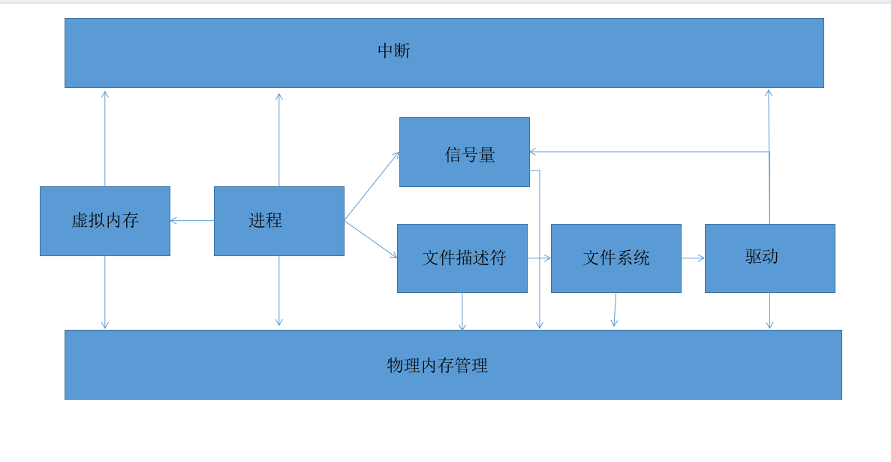

## EcallFinalOS 总体设计
EcallFinalOS使用c++进行设计，总体采用了面向对象的编程方式，操作系统中由众多模块组成，每个模块均采用类来管理。内存，驱动，文件，进程，均使用C++中的类进行设计，同时创建管理器实体，每个管理器负责管理不同模块提供接口。

从静态的角度来看进程所需依赖的模块如图所示。（部分未展示）

进程负责统筹管理其他模块，而其他模块如果是每个进程都拥有的，则由模块单体负责管理，如VMS,fileobject，信号量等。如果是仅需要使用，而不是每个进程都拥有的，则由模块管理器负责，如物理内存管理等。
- 同时我们在开发过程中引入了方便调试的工具Kout负责所有调试信息的输出，这个工具极大的方便的管理调试信息。
- 本操作系统尽可能的减少使用汇编，以减少移植到其他体系架构的成本，而使用汇编，也尽可能减少内嵌汇编的使用。

By:郭伟鑫
